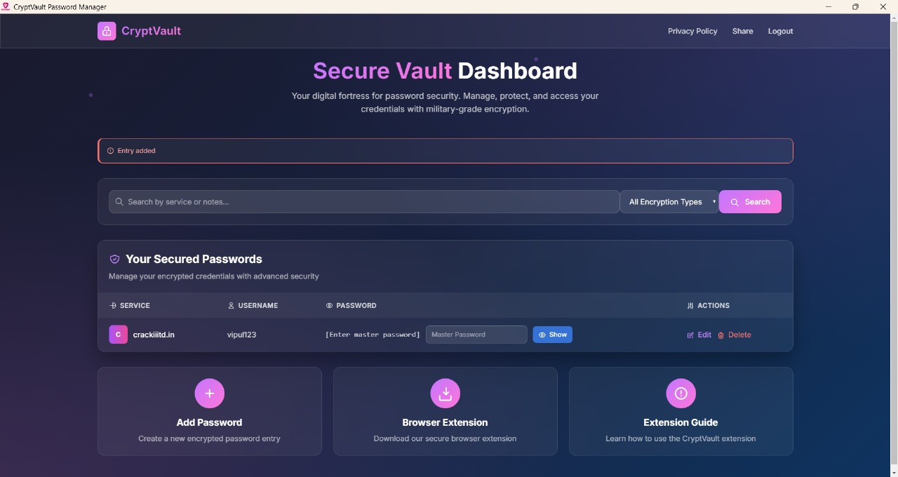
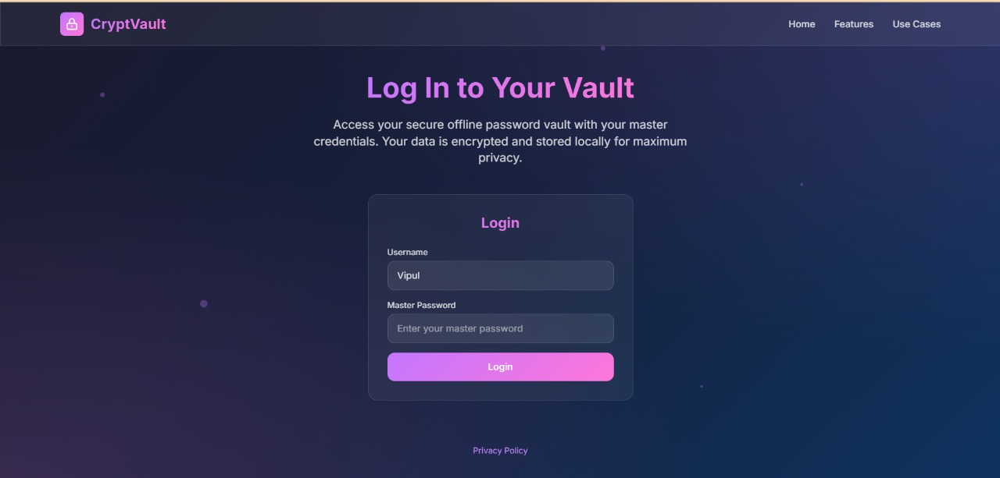
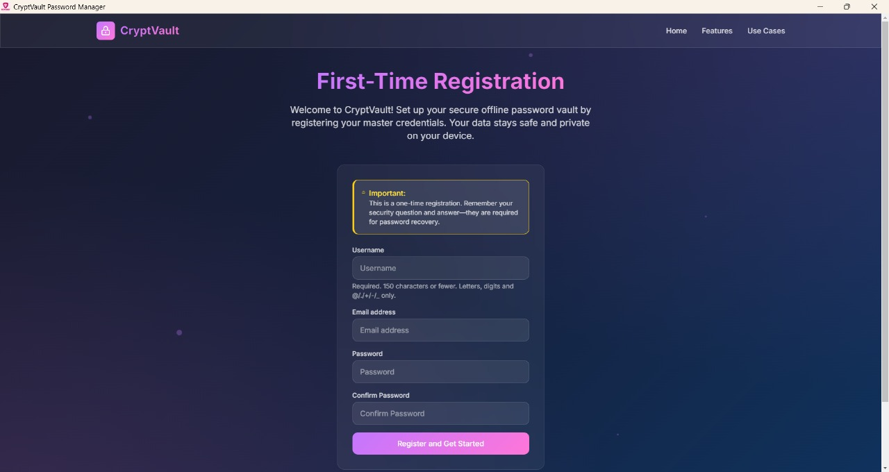
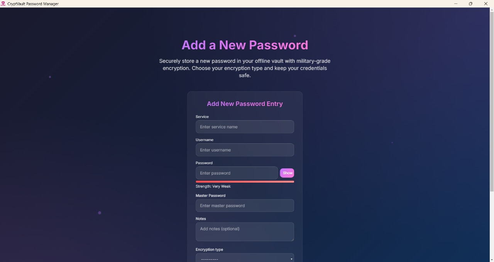
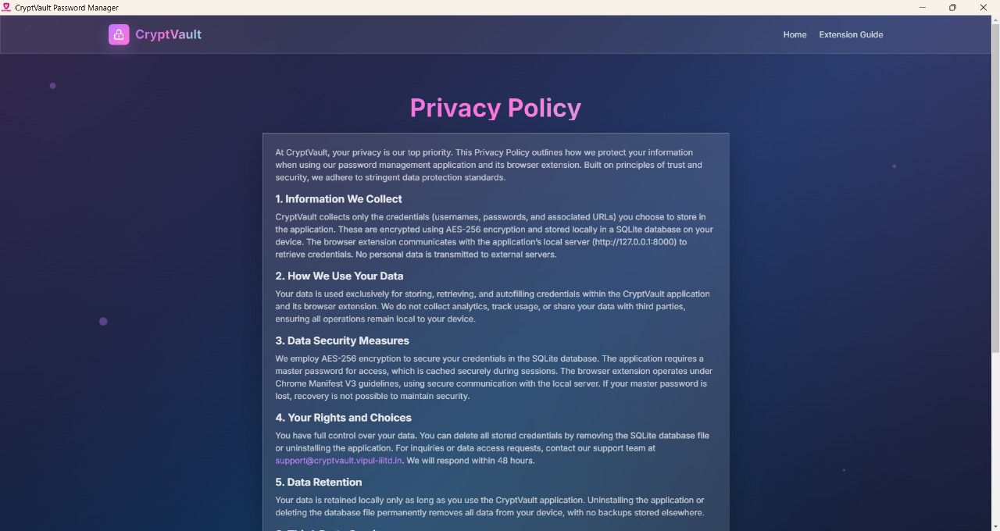
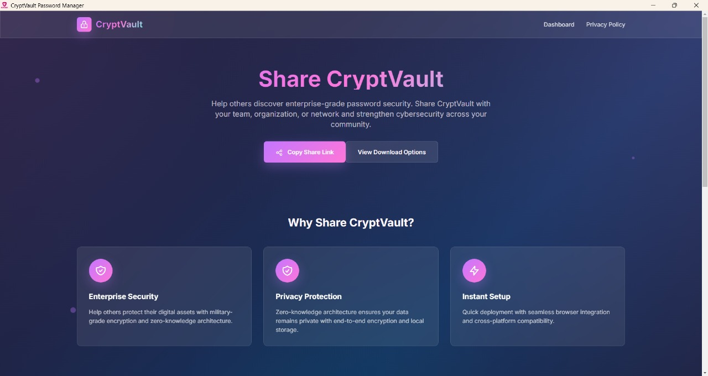
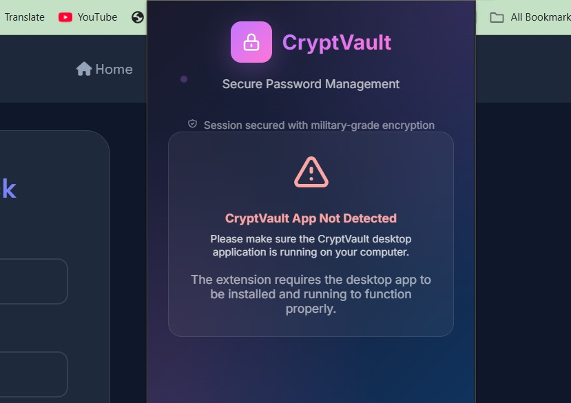
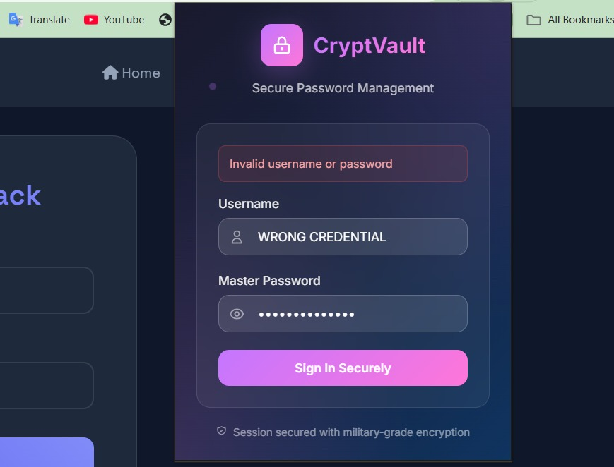
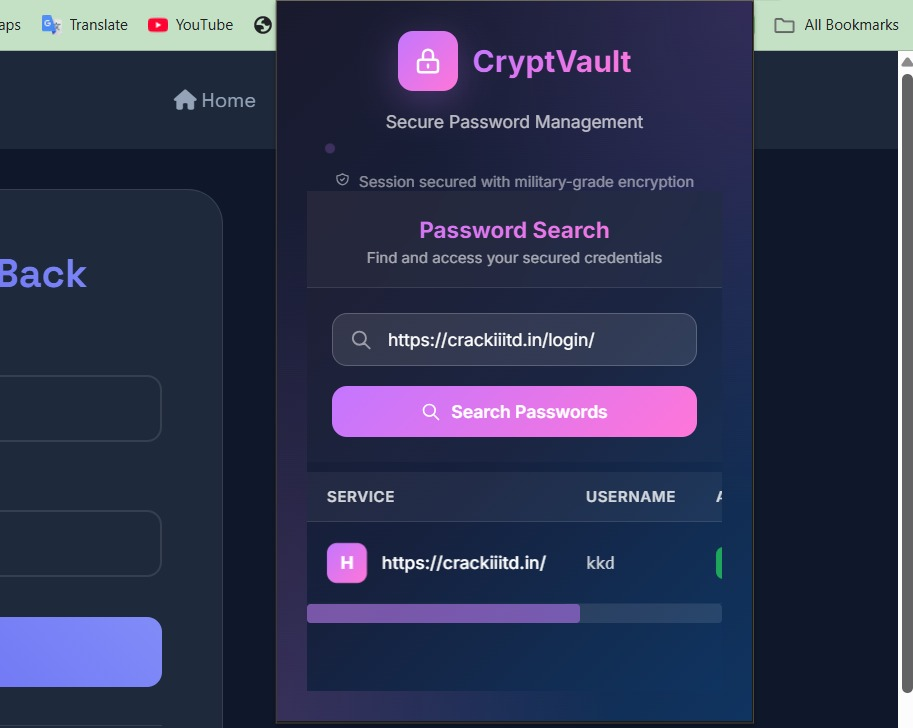
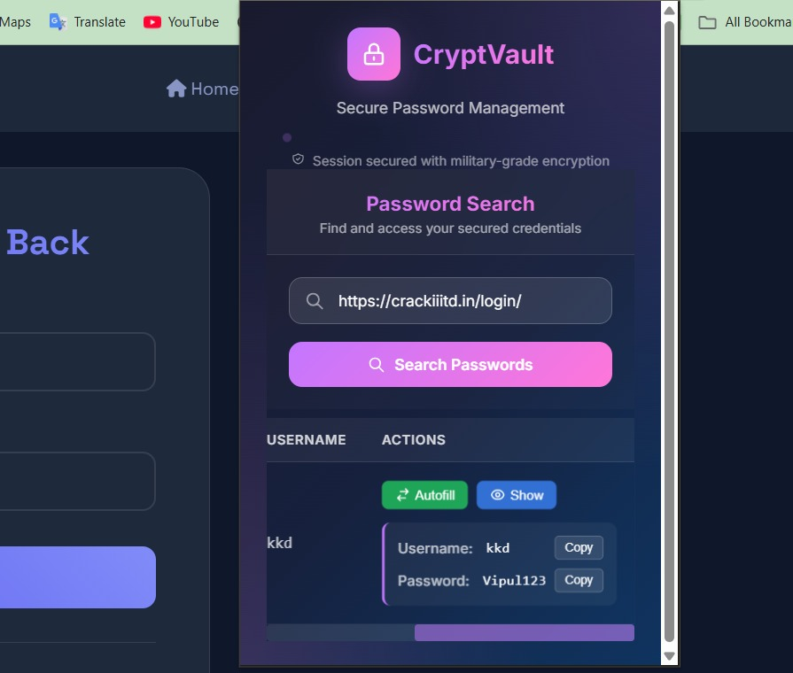

# CryptVault — A Smart Step for Data Privacy in Today’s Digital World
- **Website:** [Cryptvault.Vipul-iiitd.in](https://cryptvault.vipul-iiitd.in)
## Summary
CryptVault is an offline password manager that prioritizes data privacy with AES-256 encryption and local storage. Featuring a desktop application and a browser extension, it allows users to securely manage and auto-fill credentials without relying on cloud services, offering a robust solution against data breaches.

## Home Page
## 👋 Welcome Page
- This is the first screen users see when they launch CryptVault.
- It briefly explains what the app does — securely managing passwords offline using AES-256 encryption.
- The page offers buttons for new user registration or existing user login, guiding them to set up their master password or access their vault.

### 🏠 **Home Page**
- After logging in with the master password, users are redirected to the **Home Page**.
- The **Home Page** provides access to credential management, including viewing, adding, and editing saved credentials.

---

### 🔐 **User Login**
- Users log in using a unique **master password** to access CryptVault.


---

### 📝 **Registration**
- New users can set up CryptVault by creating a **master password** during initial setup.


---

### ➕ **Add Credential Page**
- Users can add new credentials (website, username, password) securely on the **Add Credential Page**.


---


## 🔒 Privacy Page
- Explains how CryptVault stores all data locally with AES-256 encryption.
- No cloud, no sync — 100% offline for maximum privacy and control.



---

## 📤 Share Page
- Allows users to export encrypted credentials locally to a file for backup or manual transfer.
- No online sharing or uploads are allowed, ensuring complete security.

## Extension Section

### 🌐 **CryptVault Extension Overview**

- The **CryptVault Extension** is a browser add-on designed to enhance security and convenience by auto-filling saved credentials on login pages. It communicates exclusively with the local CryptVault application via localhost (e.g., `http://127.0.0.1:8000`), ensuring no data is transmitted over the internet. This offline-first approach minimizes exposure to external threats, making it a robust solution for privacy-conscious users.

### 🔑 **Extension Login Page**


- Upon installation, the extension prompts users to log in with their master password to authenticate with the local CryptVault app.


- **Details**: This page ensures secure initialization by validating the master password against the locally stored encrypted database. Only after successful authentication can the extension access and manage credentials.

### 📋 **Fetching Page**
- When a user visits a login page (e.g., a website), the extension detects the URL and offers to auto-fill the username and password fields with saved credentials.

- **Details**: The auto-fill feature leverages the Chrome Extension API to match the current webpage URL with stored entries. It fetches encrypted data from the local server, decrypts it in real-time using the master password, and populates the fields securely. Users can select from multiple saved credentials if available for the site.

### ⚙️  **Autofill Page **
- The Autofill page allows users to view fetched credentials and automatically fill login forms with a single click. It displays stored usernames and passwords (fetched securely from the local CryptVault app) for the active website, offering a seamless and secure login experience.
- **Details**:This panel shows matching credentials based on the currently open site, along with a “Show” button to reveal the password (after user authentication if needed) and an “Autofill” button to insert credentials directly into the form. Communication is handled locally over localhost, ensuring no sensitive data is exposed to the internet. This feature combines convenience with full user control, reinforcing privacy without compromising usability.



---

## Features
- **Offline Operation**: Runs locally, eliminating cloud vulnerabilities.
- **AES-256 Encryption**: Secures all credentials with strong encryption.
- **Credential Management**: Add, edit, or delete website credentials.
- **Auto-Fill Extension**: Browser extension for seamless login experiences.
- **Portable**: Single .exe file for easy installation via PyInstaller.

## Requirements
- Python 3.x
- Django 3.x or later
- PyQt5 for desktop UI
- PyInstaller for packaging
- Chrome Extension API support

## Installation and Setup

### Step 1: Clone the Repository
Clone the repository to your local machine:
```bash
git clone https://github.com/vipul0127/CryptVault.git
cd CryptVault

### Step 2: Install Dependencies
Create a virtual environment and install required packages:
```bash
python3 -m venv venv
source venv/bin/activate  # On Windows, use `venv\Scripts\activate`
pip install -r requirements.txt
```

**Details:** This step sets up an isolated Python environment to avoid conflicts and installs all necessary libraries listed in `requirements.txt`, such as Django, PyQt5, and PyInstaller.

### Step 3: Build the Executable
Package the application into a single `.exe` file:
```bash
pyinstaller --onefile cryptvault.py
```

**Details:** Using PyInstaller, this command compiles the Python script into a standalone executable, making it easy to distribute and run on Windows without requiring Python installation.

### Step 4: Install the Extension
Load the extension folder into your browser as an unpacked extension.

**Details:** Open your browser (e.g., Chrome), go to `chrome://extensions/`, enable "Developer mode," and select the extension folder to load. This integrates the extension with the local CryptVault app.

### Step 5: Run the Application
Launch the generated `.exe` file to start CryptVault.

**Details:** Double-click the `.exe` file in the `dist` folder to initiate the application, prompting the user to log in with their master password.

## Usage

- Log in with your master password.  
- Manage credentials via the desktop UI.  
- Use the extension for auto-filling on supported websites.

**Details:** After login, the UI allows full credential management, while the extension enhances efficiency by auto-filling on compatible sites securely.

## Tech Stack

- **Backend:** Django  
- **UI:** PyQt5  
- **Encryption:** AES-256  
- **Packaging:** PyInstaller  
- **Extension:** Chrome Extension API  
- **Local Communication:** Localhost

**Details:** This stack ensures a secure, offline, and user-friendly experience with robust encryption and local data handling.

## Contributing

Fork the repository, submit issues, or create pull requests. Contributions are appreciated!

**Details:** Open-source collaboration is encouraged to improve features and fix bugs.

## Future Improvements

- Support for additional browsers.  
- Enhanced UI with dark mode.  
- Backup and restore functionality.

**Details:** Planned enhancements aim to expand compatibility and add user convenience features.

## License

MIT License

**Details:** This permissive license allows free use, modification, and distribution of the code.

## Contact

- **GitHub:** [@Vipul0127](https://github.com/vipul0127)  
- **LinkedIn:** [@Vipul-iiitd](https://linkedin.com/in/vipul-iiitd)  
- **Website:** [Portfolio.Vipul-iiitd.in](https://portfolio.vipul-iiitd.in)

**Details:** Reach out for collaboration or inquiries about the project.


